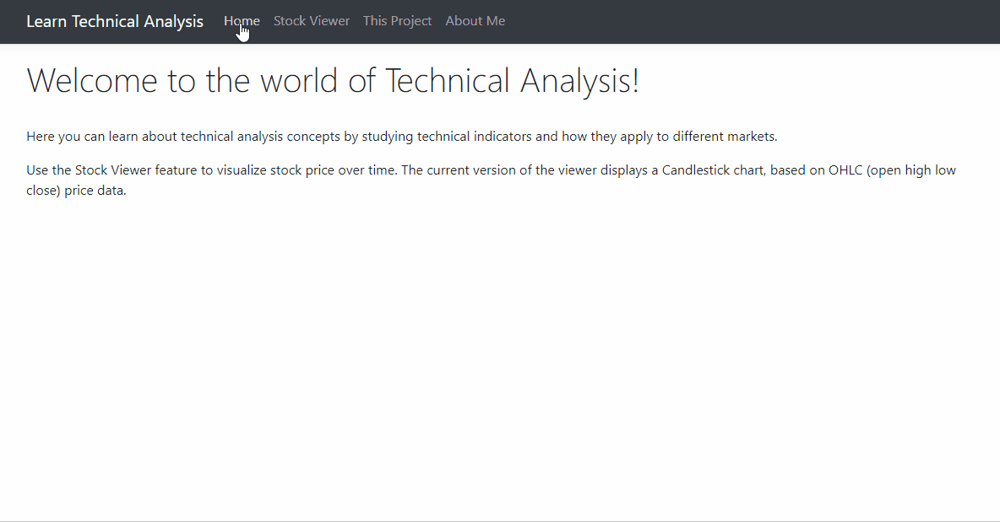

# Stock Viewer

This is a practice project for me on how to build a web app using C#, HTML, CSS, JavaScript, ASP.Net Core, Razor Pages and Bootstrap.

The motivational context is to create an educational style website about technical indicators used in financial markets trading and analysis.

So far the stock viewer allows the user to display a stock chart with market data from Yahoo Finance API, by selecting the ticker, period and time frame, and using Highcharts for visualization. (I plan to add more functionality in the future as I learn more about web development in .Net).

#### What I learned (concepts implemented): 
dependency injection, razor pages, tag helpers, js charts, field validation, model binding, asynchronous programming, API access, json serialization;
